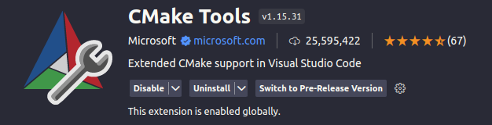

# Validation des installations C++

## Prérequis

Assurez-vous d'avoir les éléments suivants installés sur votre système avant de commencer :

- Visual Studio Code (VSCode) : [Télécharger ici](https://code.visualstudio.com/)
- CMake : [Télécharger ici](https://cmake.org/download/)
- Un compilateur C++ compatible, tel que g++ (GNU C++) ou clang (LLVM)

## Télécharger le dépôt

```bash
git clone https://github.com/ue12-p23/cplusplus-debug-vscode-cmake.git
cd cplusplus-debug-vscode-cmake
code .
```

## Extension VSCode

Pour commencer vous allez avoir besoin de l'extension CMake de VSCode, à installer depuis le gestionnaire d'extension.



Une fois l'extension installée fermer VSCode et le rouvrir dans le dossier du projet.

## Configuration

Une fois le projet ouvert dans VSCode, vous devriez voir un fichier CMakeLists.txt. C'est le script de configuration de CMake pour votre projet.

Cliquez sur l'icône de la roue dentée en bas à gauche de la fenêtre VSCode et sélectionnez "Build".

Cela générera les fichiers de configuration CMake et vous permettra de sélectionner le kit de construction approprié (par exemple, GCC ou Clang).

## Compilation du projet

Après avoir configuré CMake et sélectionné le compilateur, cliquez à nouveau sur l'icône de la roue dentée en bas à gauche de la fenêtre VSCode, puis sélectionnez "Build" pour compiler le projet.

Les fichiers exécutables résultants seront générés dans un dossier comme "bin" ou "build" (en fonction de votre configuration) dans le répertoire du projet.

## Débug

Pour déboguer votre application, placez des points d'arrêt (breakpoints) dans votre code source en cliquant sur la marge à gauche des numéros de ligne.

Cliquez sur l'icône de débogage dans la barre latérale de gauche de VSCode, puis cliquez sur le bouton "Start Debugging" (ou utilisez F5).

Vous pouvez naviguer dans votre code et inspecter les variables pendant le débogage.

## Exécution des exécutables

Les fichiers exécutables générés lors de la compilation peuvent être exécutés à partir du terminal de votre choix en utilisant la ligne de commande.

```bash
cd build/
./src/app/main.out
```

C'est tout ! Vous devriez maintenant être en mesure de configurer, compiler, déboguer et exécuter votre projet C++ dans VSCode en utilisant CMake. Si vous avez des questions ou des problèmes, n'hésitez pas à demander de l'aide.
